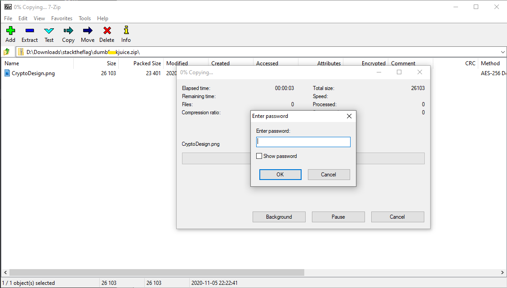
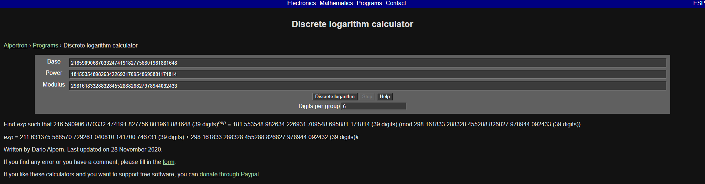
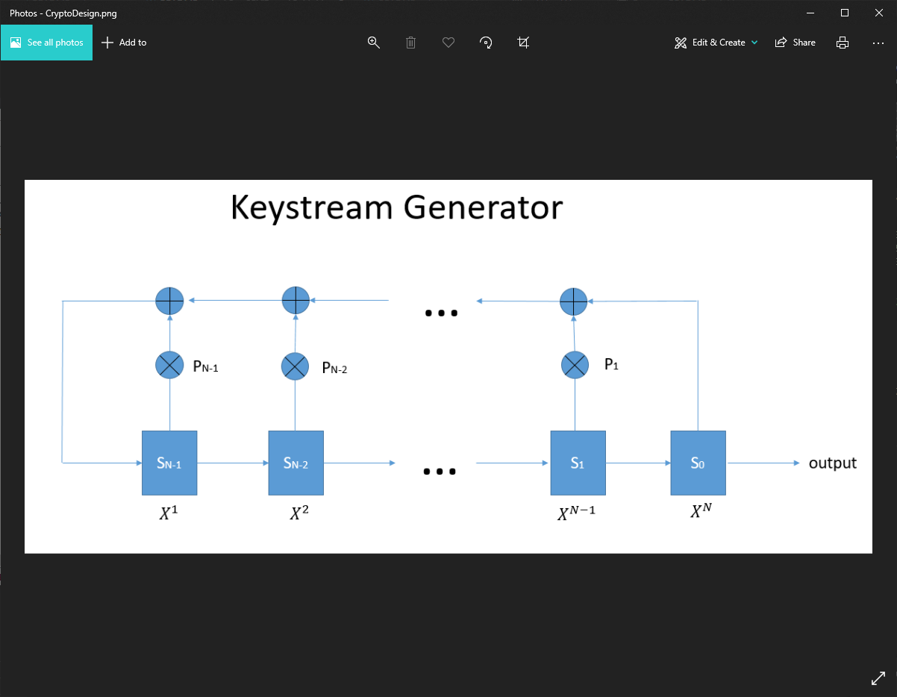

# Can COViD steal Bob's idea?

> Points: 968 [1000]

## Description

> Bob wants Alice to help him design the stream cipher's keystream generator base on his rough idea. Can COViD steal Bob's "protected" idea?
> 
> Please view this [Document](https://docs.google.com/document/d/1GrQ6znlN2Z0tu_uAPAs1qrn6by24I51mq8RIIHmFGDU/edit?usp=sharing)  for download instructions.
> 
> This challenge:
> - Unlocks other challenge(s)
> - Is eligible for Awesome Write-ups Award

## Solution

1. We are given a PCAP file that contains all the required information needed for the challenge. So the first thing I did was to filter everything to TCP only.
2. Analyzing the first few packets will reveal that Alice sent the following messages message through TCP
> p = 298161833288328455288826827978944092433  
> g = 216590906870332474191827756801961881648  
> g^a = 181553548982634226931709548695881171814  
> g^b = 64889049934231151703132324484506000958  
> 
> Hi Alice, could you please help me to design a keystream generator according to the file I share in the file server so that I can use it to encrypt my 500-bytes secret message? Please make sure it run with maximum period without repeating the keystream. The password to protect the file is our shared Diffie-Hellman key in digits. Thanks.
3. The subsequent few TCP packets shows `pyftpd` protocol sending a ZIP file over.
4. If we were to export the ZIP file, we will realise that the ZIP file is corrupted.
5. Then further analysis shows that I have forgotten to append an additional packet worth of ZIP data. So fixing that will yield a nice ZIP file that is password protected.

6. So googling for Diffie Hellman crackers, I stumbled upon a post on CTFTime by Tudor_OG: https://ctftime.org/writeup/12240
7. Clicking on the calculator he gave, I was able to crack the original `a` and `b` values (but honestly you only need one...)

8. Throwing into python using the formula `s = g^b^a (mod p)`, we can derive the secret key.
```python
a = 211631375588570729261040810141700746731
gb = 64889049934231151703132324484506000958
p = 298161833288328455288826827978944092433
s = pow(gb, a, p)
print(s)
# Output: 246544130863363089867058587807471986686
```
9. We can then test the secret with the zip, which will give us the cryptography design:

10. The flag is then the secret value that we derived!

## Flag
`govtech-csg{246544130863363089867058587807471986686}`