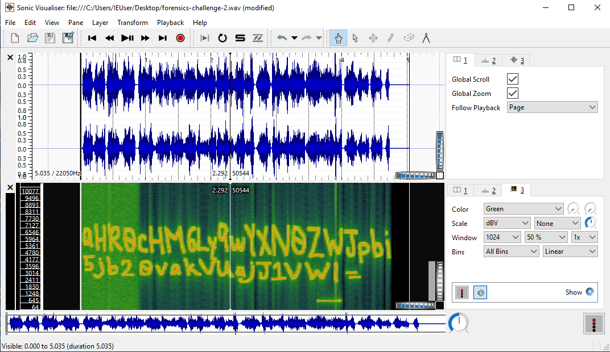
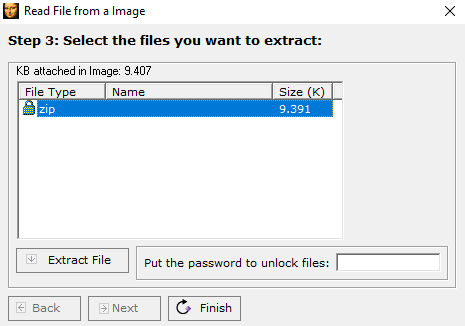
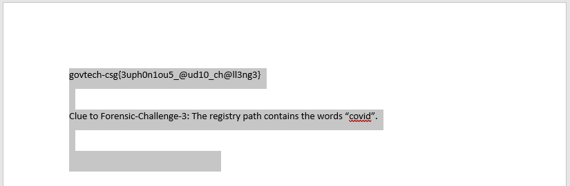

# Voices in the head

> Points: 1964 [2000]

## Description

> We found a voice recording in one of the forensic images but we have no clue what's the voice recording about. Are you able to help?
>
> Please view this [Document](https://docs.google.com/document/d/1GrQ6znlN2Z0tu_uAPAs1qrn6by24I51mq8RIIHmFGDU/edit?usp=sharing) for download instructions.
> 
> This challenge:
> - Unlocks other challenge(s)
> - Is eligible for Awesome Write-ups Award
> - Prerequisite for Mastery Award - Forensicator
> 
> Hint:
> Xiao wants to help. Will you let him help you?

## Solution

We were given a `wav` audio file so this is a audio steganography challenge.

The first two actions that came to mind were to check for hidden files using *DeepSound* and hidden messages in *SonicVisualizer*.

Opening the `wav` file through *DeepSound* did not show any hidden files to extract.

Viewing the spectrogram (`Pane > Add Spectrogram > forensics-challenge-2.wav: Channel 1`) in *SonicVisualizer* presented much more interesting results!



The spectrogram hid a base64 string `aHR0cHM6Ly9wYXN0ZWJpbi5jb20vakVUajJ1VWI=` which revealed a link to a pastebin (https://pastebin.com/jETj2uUb) when decoded.

The pastebin contained `brainfuck` code and when executed in an online interpreter prints `thisisnottheflag`.

```brainfuck
++++++++++[>+>+++>+++++++>++++++++++<<<<-]>>>>++++++++++++++++.------------.+.++++++++++.----------.++++++++++.-----.+.+++++..------------.---.+.++++++.-----------.++++++.
```

We faced a roadblock at this point so we made use of the given hint:
> Xiao wants to help. Will you let him help you?

After a quick search for `Xiao Steganography`, we found a [Windows software](https://xiao-steganography.en.softonic.com/) of the same name.

Running *Xiao Steganography* and loading the `wav` audio file showed that there was a hidden `zip` archive.



Simply extracting the `zip` file will corrupt it. Using the previously found string `thisisnottheflag` as the password will correctly extract the `zip` file.

The extracted `zip` archive is password protected and has one compressed file `This is it.docx`. This time however, `thisisnottheflag` is not the password to extract the document.

In an attempt to view the contents we ran `strings` on the `zip` file:

```bash
$ strings extracted.zip
This is it.docx
...
This is it.docx
govtech-csg{Th1sisn0ty3tthefl@g}PK
```

We are able to extract `This is it.docx` with the password `govtech-csg{Th1sisn0ty3tthefl@g}` and view the document.



And we have the flag!

Additionlly, selecting all texts reveals a line in white font colour.

```
govtech-csg{3uph0n1ou5_@ud10_ch@ll3ng3}

Clue to Forensic-Challenge-3: The registry path contains the words “covid”.

The attacker like to use Bifid Cipher
```

## Flag
`govtech-csg{3uph0n1ou5_@ud10_ch@ll3ng3}`
