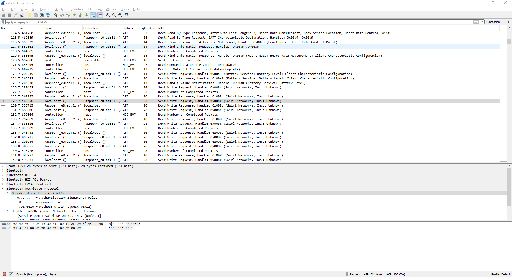
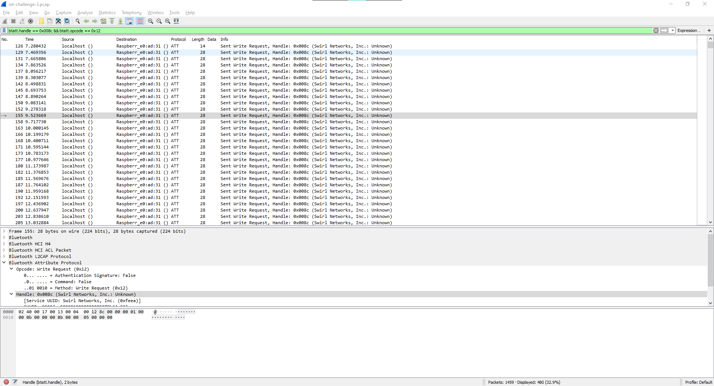
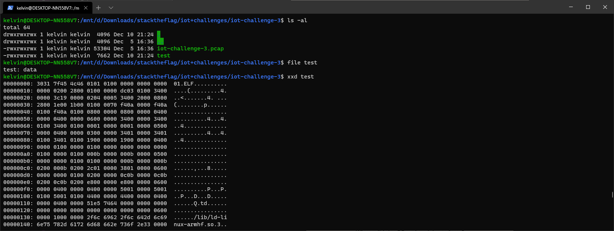
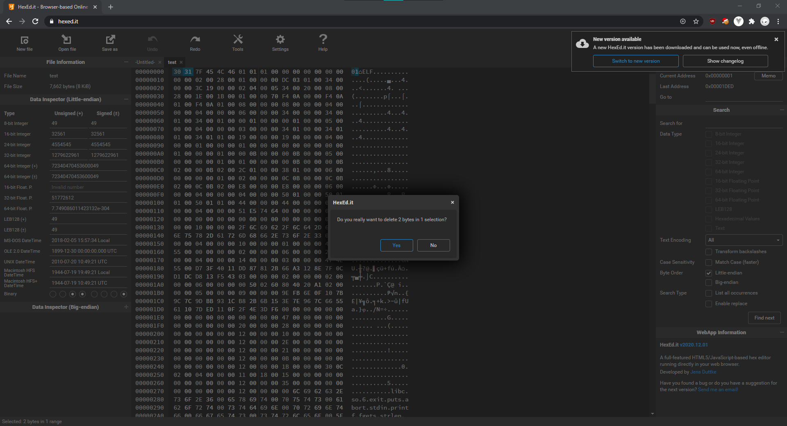
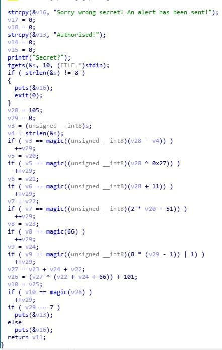

# I smell updates!

> Points: 1989 [2000]

## Description

> Agent 47, we were able to retrieve the enemy's security log from our QA technician's file! It has come to our attention that the technology used is a 2.4 GHz wireless transmission protocol. We need your expertise to analyse the traffic and identify the communication between them and uncover some secrets! The fate of the world is on you agent, good luck.
> 
> Please view this [Document](https://docs.google.com/document/d/1GrQ6znlN2Z0tu_uAPAs1qrn6by24I51mq8RIIHmFGDU/edit?usp=sharing) for download instructions.
> 
> This challenge:
> - Unlocks other challenge(s)
> - Is eligible for Awesome Write-ups Award

## Solution
In this challenge, we were given a [pcap](iot-challenge-3.pcap) file which contains sniffed Bluetooth packets. Scrolling down the packet listing in wireshark, we can see that there is a packet which contains the ELF header...



From there, we filtered the packets to show only the Write Opcode and the same handle with `btatt.handle == 0x008c && btatt.opcode == 0x12`. This yielded us with something similar to a full file.



Then, we can use some python and scapy magic to export all the bytes we want...

```python
from scapy.all import *

packets = rdpcap("iot-challenge-3.pcap")
with open('test', 'wb') as f:
    f.write(reduce(lambda a,b: a + b, (x["ATT_Write_Request"].data for x in packets if "ATT_Write_Request" in x and "ATT_Hdr" in x and x["ATT_Write_Request"].gatt_handle == 0x8c and x["ATT_Hdr"].opcode == 0x12)))
```

Then we try to check the file type, only to realise that there are 2 extra bytes at the start of the file that we have to remove...



So after fixing it in https://hexed.it/, we can now see that it is an ELF executable that is compiled for ARM processors.


```sh
file test-fixed
# Output: test-fixed: ELF 32-bit LSB executable, ARM, EABI5 version 1 (SYSV), dynamically linked, interpreter /lib/ld-linux-armhf.so.3, for GNU/Linux 2.6.32, BuildID[sha1]=d73f4011dd87812b66a3128e7f0cd1dcd813f543, not stripped
```

Decompiling in IDA shows that the code runs some magic function to check a string of length 8, and each character will perform some magic operation and be checked for correctness (which should be the flag).



Using the magic of IDA's decompiled code, and fixing it up a bit, [we coded out a function to print all the values found in the comparison [iot-challenge-3.c]](iot-challenge-3.c), and volia, we got our flag!

```sh
gcc iot-challenge-3.c
./a.out
# Ouput: aNtiB!e
```

## Flag
`govtech-csg{aNtiB!e}`