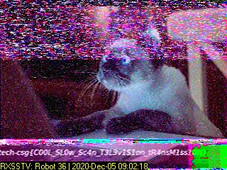

# Beep Boop

> Points: 950 [1000]

## Description

> As part of forensic investigations into servers operated by COViD, an investigator found this sound file in a folder labeled "SPAAAAAAAAAAAAAAAAAACE". Help us uncover the secret of the file.
> 
> Please view this [Document](https://docs.google.com/document/d/1GrQ6znlN2Z0tu_uAPAs1qrn6by24I51mq8RIIHmFGDU/edit?usp=sharing) for download instructions.

## Solution

We are given a `wav` audio file for this challenge.

The big hint here was
> SPAAAAAAAAAAAAAAAAAACE

SSTV is a method to send images from space. We can use [RX-SSTV](http://users.belgacom.net/hamradio/rxsstv.htm) to listen and decode the audio into an image.

RX-SSTV DSP Settings
|DSP|Value|
|:--|----:|
|AFC| ON  |
|LMS| ON  |
|BPF| OFF |

## Flag
`govtech-csg{C00L_SL0w_Sc4n_T3L3v1S1on_tR4nsM1ss10N}`