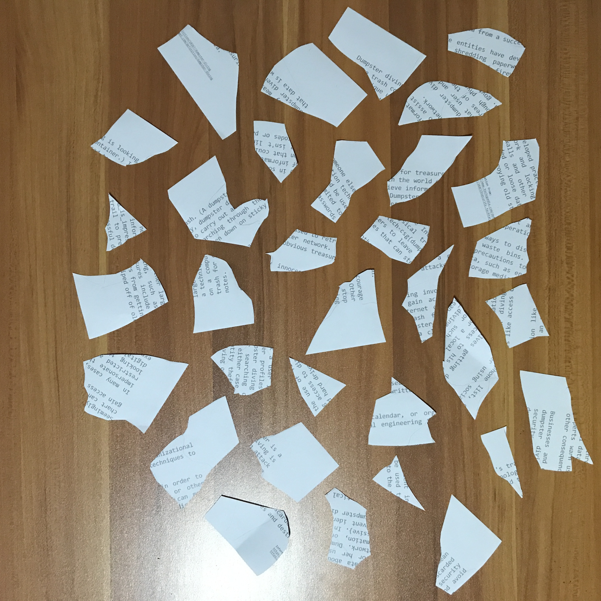
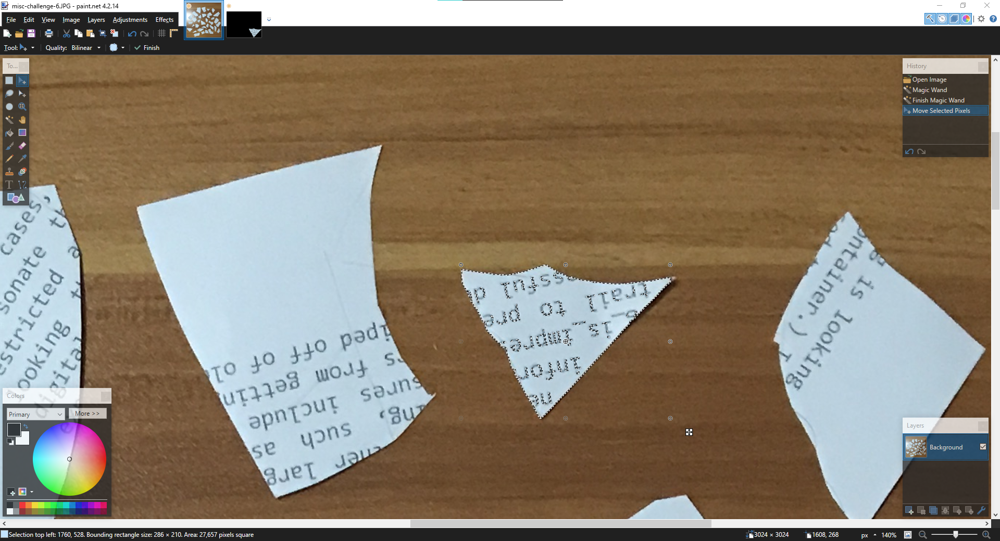
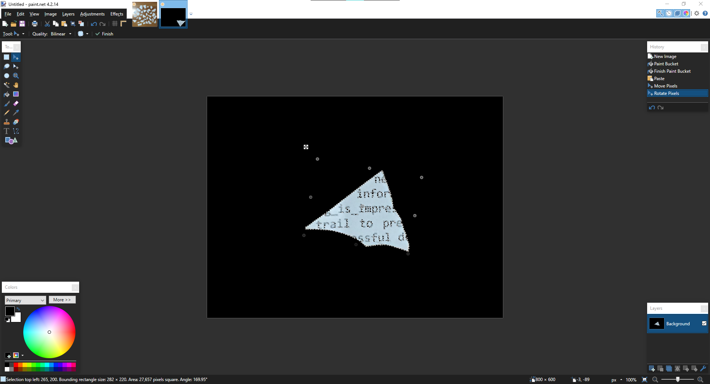
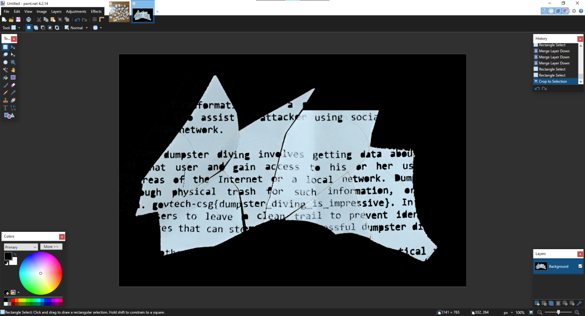

# Diving in

> Points: 526 [1000]

## Description

> We found some papers in the bin. Retrieve the flag!
> 
> Please view this [Document](https://docs.google.com/document/d/1GrQ6znlN2Z0tu_uAPAs1qrn6by24I51mq8RIIHmFGDU/edit?usp=sharing)  for download instructions.
> 

## Solution
1. We are given torn pieces of paper to attempt to reconstruct the text

2. ...or I can be lazy and reconstruct only the things that looks like a flag. So I used Paint.NET's magic wand to select the pieces that look interesting.

3. And paste it on a new picture with a black background.

4. After finding all the required pieces, we get the flag!

## Flag
`govtech-csg{dumpster_diving_is_impressive}`