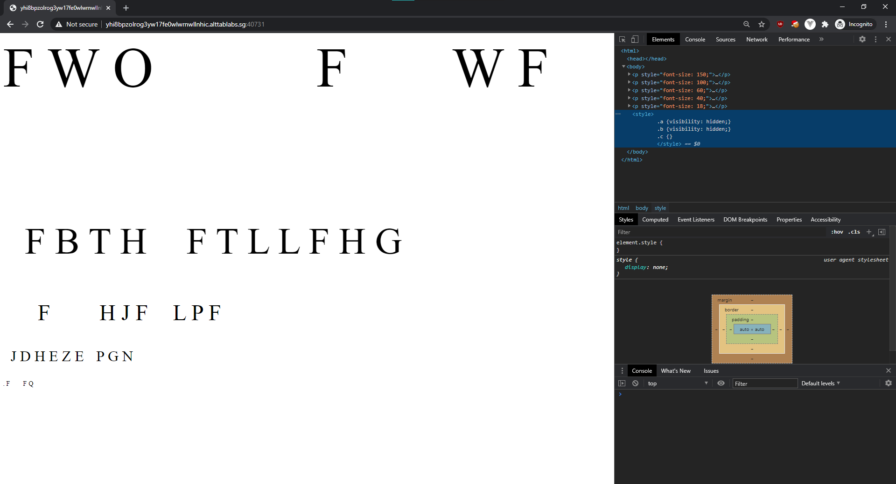
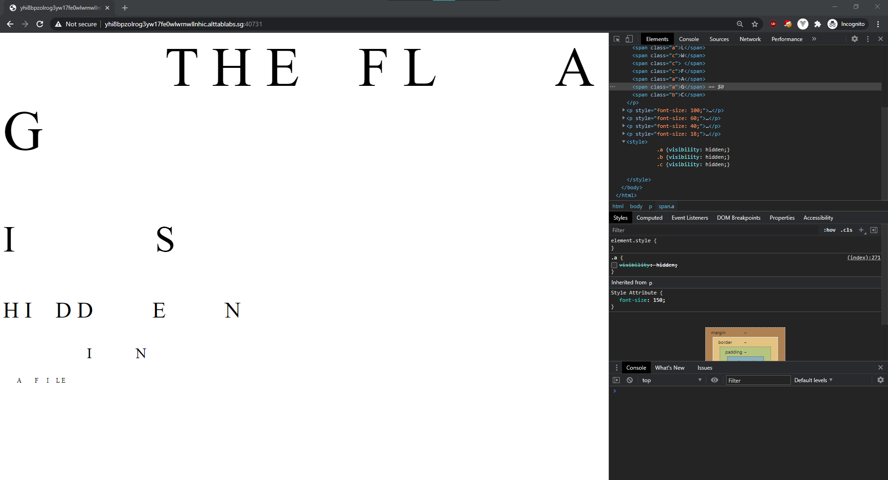
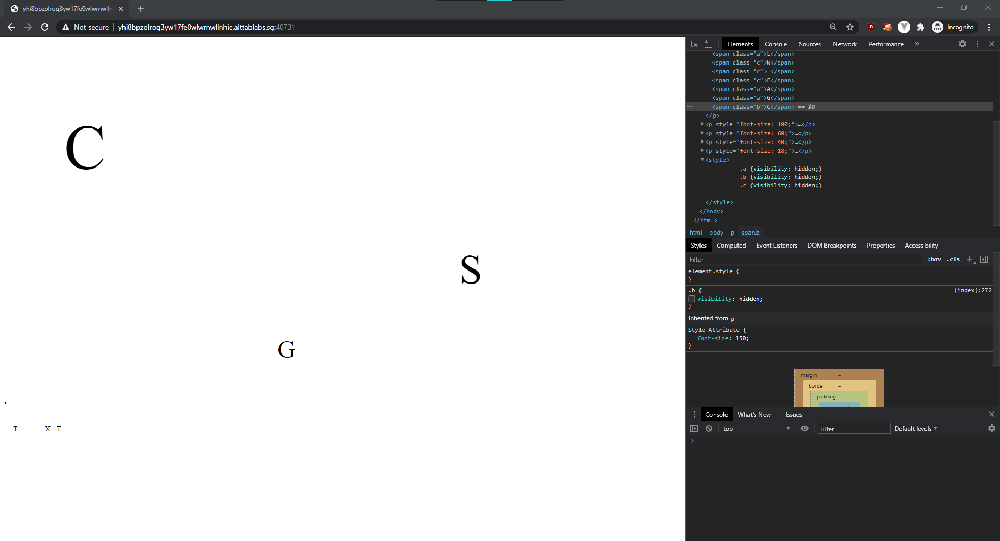
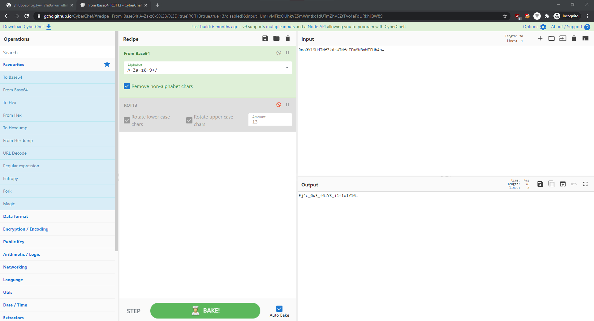

# FWO FWF

> Points: 587 [1000]

## Description

> As part of forensic investigations into servers operated by COViD, an investigator found this web server containing a hidden secret. Help us find the contents of this secret.
> 
> [Web Server](http://yhi8bpzolrog3yw17fe0wlwrnwllnhic.alttablabs.sg:40731/)
> 

## Solution
1. The webpage shows some gibberish characters when we visit it. From the developer console, we can see some internal CSS with three classes `a`, `b` and `c`.

2. If we were to toggle between the classes, we will see that the flag is in a file called `csg.txt`.

3. Visiting `http://yhi8bpzolrog3yw17fe0wlwrnwllnhic.alttablabs.sg:40731/CSG.TXT` will yield the Base64 string:
> Rmo0Y19HdTNfZkdsWTNfaTFmMW8xWTFHbAo=
4. Decoding the Base64 string does not directly give the flag, but it gave a ciphertext of `Fj4c_Gu3_fGlY3_i1f1o1Y1Gl`.
5. By playing around with all the ciphers in CyberChef, we can see they just used ROT13 to encode the string...

## Flag
`govtech-csg{Sw4p_Th3_sTyL3_v1s1b1L1Ty}`