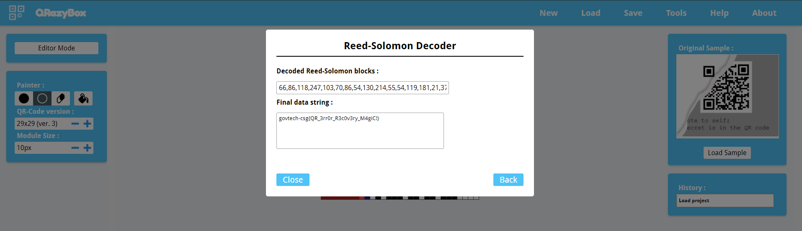

# REconstrucQ

> Points: 739 [100]

## Description

> As part of forensic investigations into servers operated by COViD, an investigator found this picture of a partially torn paper containing a QR Code. Can you recover the data within the QR Code?
> 
> Please view this [Document](https://docs.google.com/document/d/1GrQ6znlN2Z0tu_uAPAs1qrn6by24I51mq8RIIHmFGDU/edit?usp=sharing)  for download instructions.

## Solution
1. We are given a broken QR code to try and decode, so we used this website: https://merricx.github.io/qrazybox/ that allows us to (painstakingly) recreate the QR code

2. After some mangling with the squares on the left, we were able to use Reed-Solomon decoder on the website to derive the flag!

## Flag
`govtech-csg{QR_3rr0r_R3c0v3ry_M4giC!}`