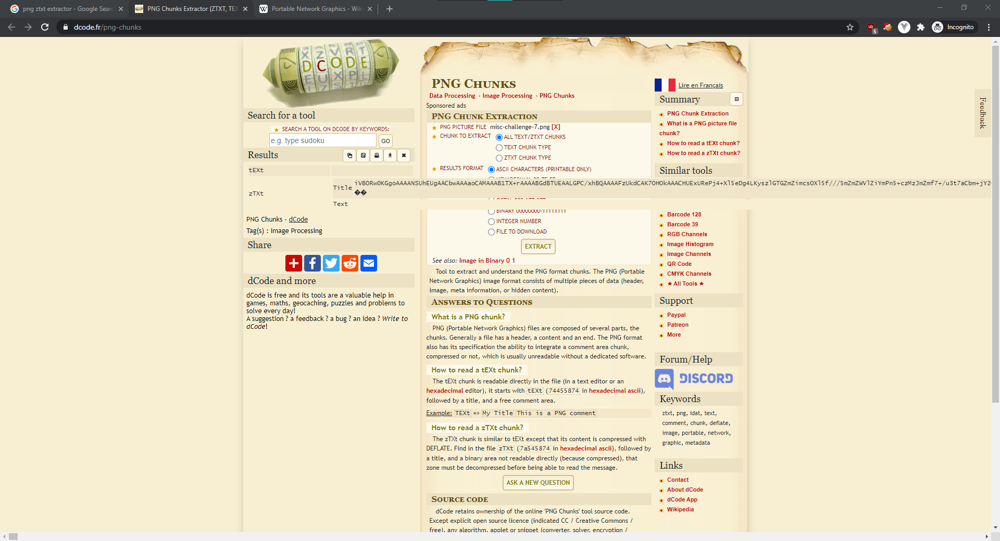
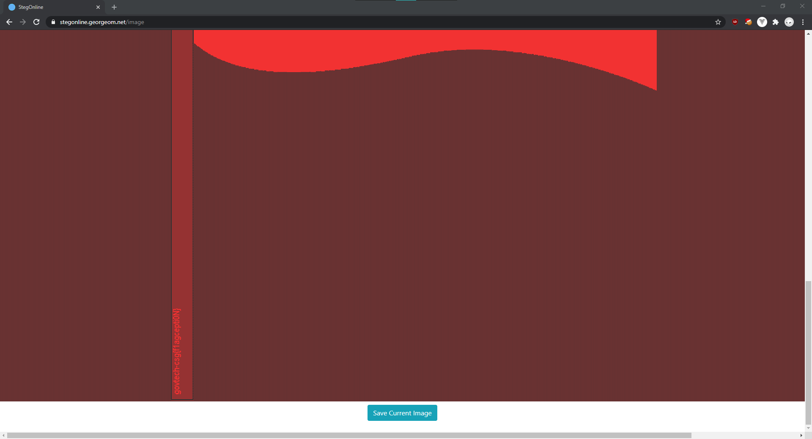

# Where's the flag?

> Points: 1971 [2000]

## Description

> There's plenty of space to hide flags in our spacious office. Let's see if you can find it!
> 
> Please view this [Document](https://docs.google.com/document/d/1GrQ6znlN2Z0tu_uAPAs1qrn6by24I51mq8RIIHmFGDU/edit?usp=sharing)  for download instructions.
> 

## Solution
1. Initially I thought there are some files hidden in between the chunks of the PNG image, so I went to [Wikipedia](https://en.wikipedia.org/wiki/Portable_Network_Graphics#Ancillary_chunks) and realised that there exists `tEXt` and `zTXt` chunks within a PNG image.
2. So I went to find a `tEXt` extractor online and found https://www.dcode.fr/png-chunks. I uploaded the image and it gave me a ridiculously long Base64 string.

3. Decoding the base64 reveals that it is another image based on its file signature of `IPNG`.

4. Unfortunately, it wasn't another `zTXT` or `tEXt` chunk, so I went online and I found this blogpost regarding StegOnline: https://medium.com/ctf-writeups/stegonline-a-new-steganography-tool-b4eddb8f8f57
5. After noticing that the image has custom colour palettes, I went and explored some random palettes to find the flag at the bottom of the pole.

## Flag
`govtech-csg{f1agceptioN}`