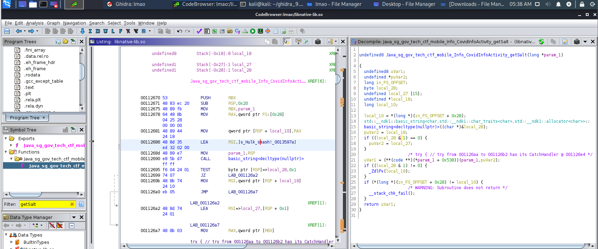

# Korovax way to protect yourself!

> Points: 1989 [2000]

## Description

> Nope! Korovax do not provide self-defence classes but Korovax has learnt about the deadly COViD and came out several ways to protect their members! Well... does Korovax truly protect their members?
> 
> Please view this [Document](https://docs.google.com/document/d/1GrQ6znlN2Z0tu_uAPAs1qrn6by24I51mq8RIIHmFGDU/edit?usp=sharing) for download instructions.
> 
> This challenge:
> - Unlocks other challenge(s)

## Solution
1. We can focus on `sg.gov.tech.ctf.mobile.Info.CovidInfoActivity`. From the first few lines of the clas, we can see a base64 string, as well as a native method `getKey()` and `getSalt()` function, which means the base64 string is probably encrypted, and the key and salt is derived from the native binary.
```java
    public String f2969b = "fFFFx2ezHvklL5t3ViKP2qQtj4oGwL1zL7Ln5rKNafM=";

    public native String getKey();

    public native String getSalt();
```
2. We can also see that there is a possible custom encryption algorithm written inside the file.
```java
// ...
import se.simbio.encryption.Encryption;
// ...
        public final /* synthetic */ Encryption f2970b;

        public a(Encryption encryption) {
            this.f2970b = encryption;
        }

        public void onClick(View v) {
            if (this.f2970b.encryptOrNull(((EditText) CovidInfoActivity.this.findViewById(R.id.editText_enteredFlag)).getText().toString()).replaceAll("\\n", BuildConfig.FLAVOR).equalsIgnoreCase(CovidInfoActivity.this.f2969b)) {
                c.a builder = new c.a(CovidInfoActivity.this);
                View view = LayoutInflater.from(CovidInfoActivity.this).inflate(R.layout.custom_alert, (ViewGroup) null);
                ((TextView) view.findViewById(R.id.title)).setText("Congrats!");
                ((TextView) view.findViewById(R.id.alert_detail)).setText("Well done!");
                f.a.a.a.a.e.b.a().d(true);
                builder.h("Proceed", new DialogInterface$OnClickListenerC0073a());
                builder.f("Close", new b());
                builder.k(view);
                builder.l();
                Toast.makeText(CovidInfoActivity.this.getApplicationContext(), "Flag is correct!", 0).show();
                return;
            }
            Toast.makeText(CovidInfoActivity.this.getApplicationContext(), "Flag is wrong!", 0).show();
        }
```
3. We can first try to derive the key and salt by decompiling the native library, which yielded us with `I can do this all day.` and `Hulk smash!` respectively.


4. Opening `se.simbio.encryption.Encryption` reveals that they have used `AES/CBC/PKCS5Padding` for encryption, and used `PBKDF2WithHmacSHA1` to generate the required key to encrypt the flag.
```java
// ...
    public String encrypt(String data) {
        if (data == null) {
            return null;
        }
        SecretKey secretKey = getSecretKey(hashTheKey(this.mBuilder.v()));
        byte[] dataBytes = data.getBytes(this.mBuilder.p());
        Cipher cipher = Cipher.getInstance(this.mBuilder.n());
        cipher.init(1, secretKey, this.mBuilder.u(), this.mBuilder.A());
        return g.a.a.a.a.f(cipher.doFinal(dataBytes), this.mBuilder.o());
    }

    public String encryptOrNull(String data) {
        try {
            return encrypt(data);
        } catch (Exception e2) {
            e2.printStackTrace();
            return null;
        }
    }
// ...
        public static c q(String key, String salt, byte[] iv) {
            c cVar = new c();
            cVar.H(iv);
            cVar.J(key);
            cVar.M(salt);
            cVar.L(128);
            cVar.K("AES");
            cVar.E("UTF8");
            cVar.G(1);
            cVar.F("SHA1");
            cVar.D(0);
            cVar.C("AES/CBC/PKCS5Padding");
            cVar.P("SHA1PRNG");
            cVar.N("PBKDF2WithHmacSHA1");
            return cVar;
        }
// ...
```
5. So we recoded the entire thing (in [lmao.java](lmao.java)), allowing us to use the `decrypt` function to get the flag.
```java
  public static void main(String[] args) {
    try {
      String key = "I can do this all day.";
      String salt = "Hulk smash!";
      String enc = "fFFFx2ezHvklL5t3ViKP2qQtj4oGwL1zL7Ln5rKNafM=";
      c a = c.q(key, salt, new byte[16]);
      a.m();
      byte dataBytes[] = f.a(enc, a.o());
      SecretKey secretKey = getSecretKey(hashTheKey(a.v(), a), a);
      Cipher cipher = Cipher.getInstance(a.n());
      cipher.init(2, secretKey, a.u(), a.A());
      System.out.println(new String(cipher.doFinal(dataBytes)));
    } catch (Exception ex) {
      System.out.println(ex.getMessage());
    }
  }
```
6. Running the function will give us the flag!
```
javac f.java lmao.java
java lmao
# Output: govtech-csg{1 Am Ir0N m@N}
```


## Flag
`govtech-csg{1 Am Ir0N m@N}`