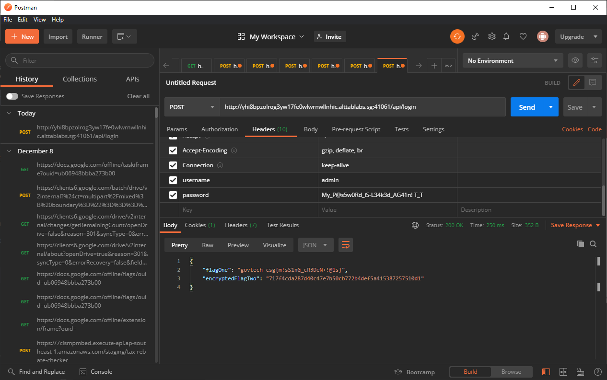

# Network?

> Points: 1991 [2000]

## Description

> Just how many times do we have to log in! Web has one, now mobile too?
> 
> Please view this [Document](https://docs.google.com/document/d/1GrQ6znlN2Z0tu_uAPAs1qrn6by24I51mq8RIIHmFGDU/edit?usp=sharing) for download instructions.
> 

## Solution
1. For this challenge, we will be analyzing the code from `sg.gov.tech.ctf.mobile.Admin.NetworkActivity.java`. From the initial analysis of the page, it appears that they are attempting to send a HTTP request to `http://yhi8bpzolrog3yw17fe0wlwrnwllnhic.alttablabs.sg:41061/api/login`, and are setting the username and password in the payload somehow.
```java
// ...
    /* renamed from: e  reason: collision with root package name */
    public String f2943e = "yhi8bpzolrog3yw17fe0wlwrnwllnhic.alttablabs.sg";

    /* renamed from: f  reason: collision with root package name */
    public String f2944f = "41061";

    /* renamed from: g  reason: collision with root package name */
    public String f2945g = ("http://" + this.f2943e + ":" + this.f2944f + "/api/login");
// ...
        public void onClick(View v) {
            NetworkActivity networkActivity = NetworkActivity.this;
            networkActivity.d(networkActivity.f2940b.getText().toString(), NetworkActivity.this.f2941c.getText().toString(), NetworkActivity.this.f2945g);
            NetworkActivity networkActivity2 = NetworkActivity.this;
            networkActivity2.c(networkActivity2.f2940b.getText().toString(), NetworkActivity.this.f2941c.getText().toString());
        }
```
2. Reading the code further, we see that they called the method `d`, which creates a new object `f.a.a.a.a.a.b`
```java
    public void d(String username, String password, String url) {
        try {
            List<String> response = new f.a.a.a.a.a.b(url, SQLiteDatabase.KEY_ENCODING, username, password).a();
            Log.v("rht", "SERVER REPLIED:");
            Iterator<String> it = response.iterator();
            while (it.hasNext()) {
                Log.v("rht", "Line : " + it.next());
            }
        } catch (IOException e2) {
            e2.printStackTrace();
        }
    }
```
3. Opening `f.a.a.a.a.a.b` reveals the true HTTP payload that will be sent to the server. In this case, we just have to set the admin username and password on the request headers to the URL to get some values back.
```java
    public b(String requestURL, String charset, String username, String password) {
        HttpURLConnection httpURLConnection = (HttpURLConnection) new URL(requestURL).openConnection();
        this.f2863a = httpURLConnection;
        httpURLConnection.setRequestMethod("POST");
        this.f2863a.setUseCaches(false);
        this.f2863a.setDoOutput(true);
        this.f2863a.setDoInput(true);
        this.f2863a.setRequestProperty("Host", "host");
        this.f2863a.setRequestProperty("Accept", "application/json, text/plain, */*");
        this.f2863a.setRequestProperty("Content-Type", "application/x-www-form-urlencoded");
        this.f2863a.setRequestProperty("User-Agent", "Mozilla/5.0 (Windows NT 10.0; Win64; x64) AppleWebKit/537.36 (KHTML, like Gecko) Chrome/83.0.4103.61 Safari/537.36 Edg/83.0.478.37");
        this.f2863a.setRequestProperty("username", username);
        this.f2863a.setRequestProperty("password", password);
        this.f2863a.getOutputStream().close();
        this.f2865c = new PrintWriter((Writer) new OutputStreamWriter(this.f2864b, charset), true);
    }
```
4. Opening up Postman, we can then send a POST request to `http://yhi8bpzolrog3yw17fe0wlwrnwllnhic.alttablabs.sg:41061/api/login`, and set the admin username and password we found in [mobile/True or false?](../True%20or%20false/README.md), then sending the payload, which yields us the flag!

```json
{
    "flagOne": "govtech-csg{m!sS1nG_cR3DeN+!@1s}",
    "encryptedFlagTwo": "717f4cda287d40c47e7b50cb772b4def5a415387257510d1"
}
```
5. But `flagOne` was not the flag... so we have to go back to `sg.gov.tech.ctf.mobile.Admin.NetworkActivity.java` to see if there was anything interesting we can use to decrypt `encryptedFlagTwo`. From the same `onClick` function, it also calls the function `c`, which provides some context to the possible encryption algorithm.
```java
    public void c(String username, String password) {
        String hexUserVal = e(username);
        String hexPassVal = e(password);
        String hexUserVal2 = b(hexUserVal);
        b(hexPassVal);
        int numberOfParts = hexUserVal2.length() / 8;
        String[] tokens = new String[numberOfParts];
        for (int i = 1; i <= numberOfParts; i++) {
            tokens[i - 1] = hexUserVal2.substring((i - 1) * 8, i * 8);
        }
        String fullEnc = BuildConfig.FLAVOR;
        for (String str : tokens) {
            fullEnc = fullEnc + bytesToHex(messy(a(Integer.parseInt(str, 16), 8), 8));
        }
    }
```
6. From the code in `c`, we can see that they are converting the username and password into hex, and after which, they took the hex version of `username` string, and shifted every 4th character to the front. Afterwhich, it calls a native function `messy`. Decompiling `messy` in `libnative-lib.so` will show that they are taking every integer and XOR-ing it with the value `0x051823ac`

7. Throwing `0x051823ac` into CyberChef with `717f4cda287d40c47e7b50cb772b4def5a415387257510d1` yields a rotated flag `tgov-ech{csgr3nC_Yp+ m3}`

8. We can then "unrotate" it with the following and we will get the flag!
```python
>> rotated_flag = "tgov-ech{csgr3nC_Yp+ m3}"
>> flag = ""                                                        
>>> for i in range(len(rotated_flag) // 4):                          
...     flag += rotated_flag[i * 4 + 1: i * 4 + 4] + rotated_flag[i * 4]
... 
>>> flag
'govtech-csg{3nCrYp+_m3} '
```

## Flag
`govtech-csg{3nCrYp+_m3}`