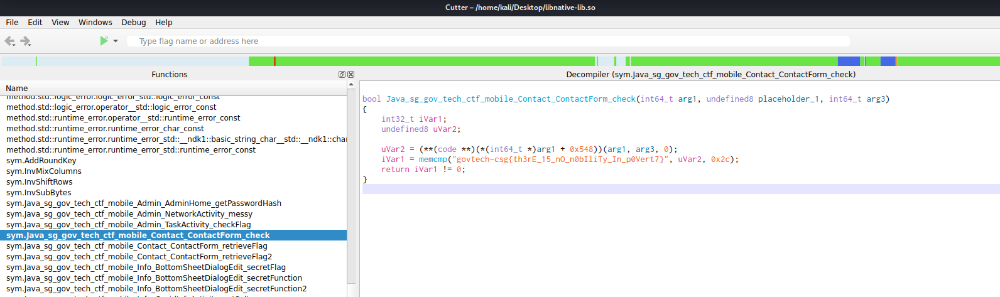

# Subscribe!

> Points: 977 [1000]

## Description

> Korovax would like to keep its users informed about the latest updates of COViD, and there's nothing better but to spam your emails!
> 
> Please view this [Document](https://docs.google.com/document/d/1GrQ6znlN2Z0tu_uAPAs1qrn6by24I51mq8RIIHmFGDU/edit?usp=sharing) for download instructions.
> 

## Solution
1. As a continuation from [`mobile/Contact Us!`](../Contact%20Us!/README.md), we continue to analyze the code from `sg.gov.tech.ctf.mobile.Contact.ContactForm.java` 
2. Unlike [`mobile/Contact Us!`](../Contact%20Us!/README.md), it appears we have to look at the `native` functions that are called within the `.java` class itself.
```java
    public native int check(String str);

    public native String retrieveFlag();

    public native int retrieveFlag2(String str, int i);
```
3. Googling about native functions tells us that there is usually a dynamic library attached to the program. In this case, there appears to be a `libnative-lib.so` attached in the apk at `resource/lib/<archtecture types>/`.
4. Opening the file in Cutter and scrolling through the functions, we will see the three functions above. When we click on `sym.Java_sg_gov_tech_ctf_mobile_Contact_ContactForm_check`, we can see a neat little flag sitting there.



## Flag
`govtech-csg{th3rE_15_nO_n0bIliTy_In_p0Vert7}`