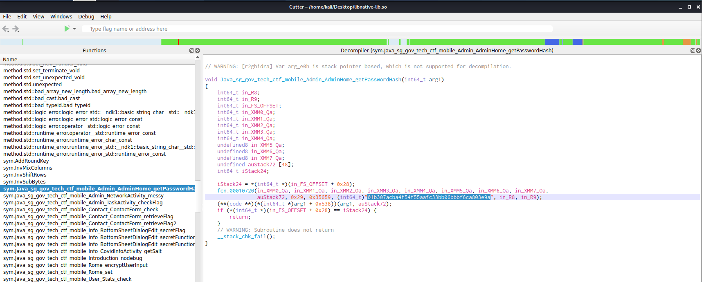
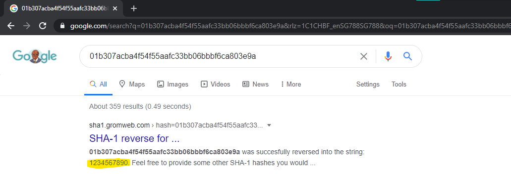

# What's with the Search!

> Points: 994 [1000]

## Description

> There is an admin dashboard in the Korovax mobile. There aren't many functions, but we definitely can search for something!
> 
> Please view this [Document](https://docs.google.com/document/d/1GrQ6znlN2Z0tu_uAPAs1qrn6by24I51mq8RIIHmFGDU/edit?usp=sharing) for download instructions.
> 
> This challenge:
> - Unlocks other challenge(s)
> - Is eligible for Awesome Write-ups Award
> - Prerequisite for Mastery Award - Mobile Ace

## Solution
1. From the continuation from [mobile/True or false?](../True%20or%20false/README.md), we first will take a look at the `sg.gov.tech.ctf.mobile.Admin.AdminHome.java`. The start of the file contains interesting native calls to `getPassswordHash()`, and it is used to compare to the user input in another `onClick()` method. If we can determine the hash method, and the original hash value, we can use it as the flag.
```java
// ...
// Line 27
    public String f2929b = getPasswordHash();
// ...
// Line 44
    public native String getPasswordHash();
// ...
// Line 88 - 104
        public void onClick(View v) {
            AdminHome adminHome = AdminHome.this;
            adminHome.f2932e = (EditText) adminHome.findViewById(R.id.editText_enteredFlag);
            if (AdminHome.this.b(AdminHome.this.c(AdminHome.this.f2932e.getText().toString())).equalsIgnoreCase(AdminHome.this.f2929b)) {
                c.a builder = new c.a(AdminHome.this);
                View view = LayoutInflater.from(AdminHome.this).inflate(R.layout.custom_alert, (ViewGroup) null);
                ((TextView) view.findViewById(R.id.title)).setText("Congrats!");
                ((TextView) view.findViewById(R.id.alert_detail)).setText("Add govtech-csg{} to what you found!");
                builder.h("Proceed", new a());
                builder.f("Close", new b());
                builder.k(view);
                builder.l();
                Toast.makeText(AdminHome.this.getApplicationContext(), "Flag is correct!", 0).show();
                return;
            }
            Toast.makeText(AdminHome.this.getApplicationContext(), "Flag is wrong!", 0).show();
        }
//...
```
3. The hashing function is located either `AdminHome.this.b()` or `AdminHome.this.c()` as it is being used to compare against the hash value. From what we see in both methods, it appears the hashing is done in `AdminHome.this.b()`, and it uses the SHA-1 algorithm (`AdminHome.this.c()` removes extra stuff at the start and end).
```java
    public final String c(String enteredFlagString) {
        if (!enteredFlagString.contains("govtech-csg{")) {
            return enteredFlagString;
        }
        String result = enteredFlagString.replace("govtech-csg{", BuildConfig.FLAVOR);
        return result.substring(0, result.length() - 1);
    }

    public String b(String toHash) {
        try {
            MessageDigest digest = MessageDigest.getInstance("SHA-1");
            byte[] bytes = toHash.getBytes(SQLiteDatabase.KEY_ENCODING);
            digest.update(bytes, 0, bytes.length);
            return bytesToHex(digest.digest());
        } catch (NoSuchAlgorithmException e2) {
            System.out.println("Algorithm not recognised");
            return null;
        } catch (UnsupportedEncodingException e3) {
            System.out.println("Something is wrong. Like really.");
            return null;
        }
    }
```
4. So we can open up Cutter to check the relevant native code in `libnative-lib.so`, and we can see there is a string in there with the value of `01b307acba4f54f55aafc33bb06bbbf6ca803e9a`, which is hashed with SHA-1, from what we found in step 3.

5. So we googled `01b307acba4f54f55aafc33bb06bbbf6ca803e9a` and lo and behold, the value is just `1234567890`...

6. So we found the flag, which is just `govtech-csg{1234567890}`

## Flag
`govtech-csg{1234567890}`