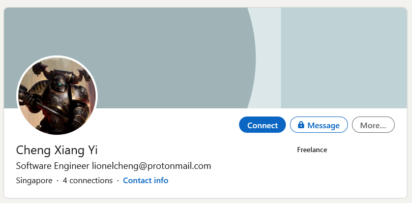

# Hunt him down!

> Points: 980 [1000]

## Description

> After solving the past two incidents, COViD sent a death threat via email today. Can you help us investigate the origins of the email and identify the suspect that is working for COViD? We will need as much information as possible so that we can perform our arrest!
>
> Please view the this [Document](https://docs.google.com/document/d/1GrQ6znlN2Z0tu_uAPAs1qrn6by24I51mq8RIIHmFGDU/edit?usp=sharing) for download instructions.
>
> Example Flag: govtech-csg{JohnLeeHaoHao-123456789-888888}
>
> Flag Format: govtech-csg{fullname-phone number[9digits]-residential postal code[6digits]}
>
> This challenge:
> - Is eligible for Awesome Write-ups Award
> - Prerequisite for Mastery Award - Intelligence Officer

## Solution

Looking at the email, we can that it was sent from the address `theOne@c0v1d.cf`. 
```bash
$ cat osint-challenge-8.eml
...
From: theOne <theOne@c0v1d.cf>
...
```

Using [`DNSDumpster`](https://dnsdumpster.com/), we found a `TXT` record containing a handle (`lionelcxy`) and an email (`lionelcheng@protonmail.com`)


We shortly found Lionel's [Twitter account](https://mobile.twitter.com/lionelcxy), which had only one [tweet](https://mobile.twitter.com/lionelcxy/status/1322079602852855814).


The tweet was referencing to his [Carousell listing](https://t.co/T4EFZDkHSg?amp=1) of a Playstation 1 on his [Carousell account](https://www.carousell.sg/lionelcxy).


We immediately can see his phone number `963672918`.

To get this full name, we searched his email `lionelcheng@protonmail.com` on Google and found his [Linkedin account](https://www.linkedin.com/in/cheng-xiang-yi-0a4b891b9/?originalSubdomain=sg).



The initials matched that of the `cxy` in his handle `lionelcxy`, hence his full name is `LionelChengXiangYi`.

To find his postal code, we will look at his [Instagram account](https://www.instagram.com/lionelcxy/).


His post showed his running path and there was a link to his [Strava account](https://www.strava.com/athletes/70911754)!


His account shows the runs that he has done.


On one of his runs, he wrote about a "Social Space" that was at his block, which I guess he is referring to his home.


 Checking online, there were 2 locations, 1 being located near Marina Bay.


"Social Space" is actually a cafe and was located at the residence "Marina One Residences"! Putting it all together in the format specified by the challenge, we get our flag.

## Flag
`govtech-csg{LionelChengXiangYi-963672918-018935} `