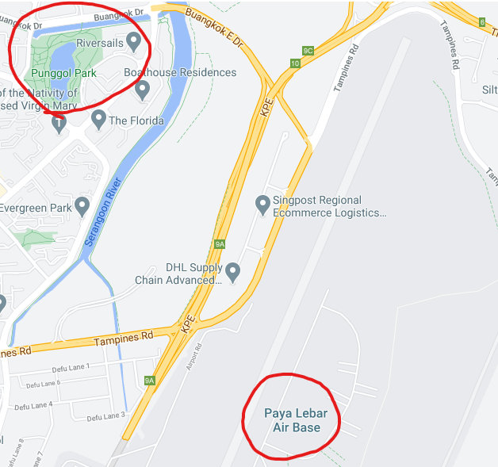
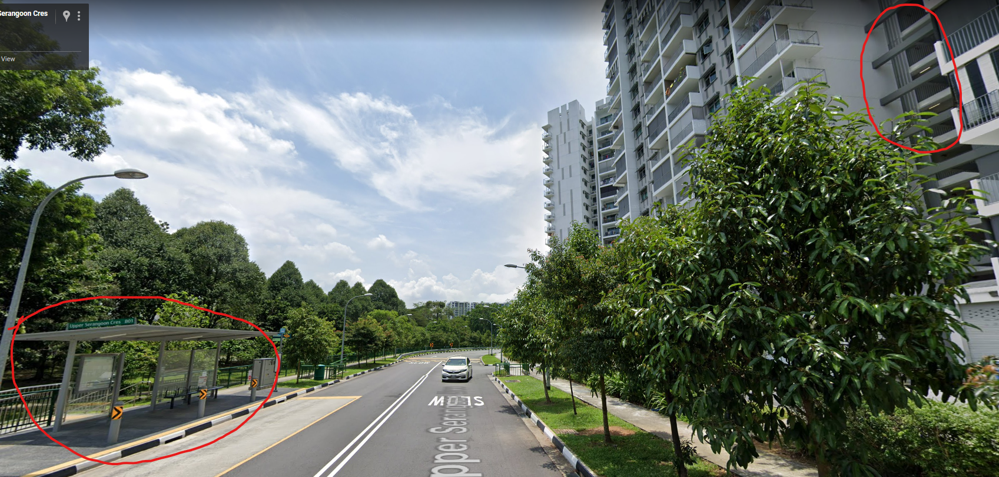
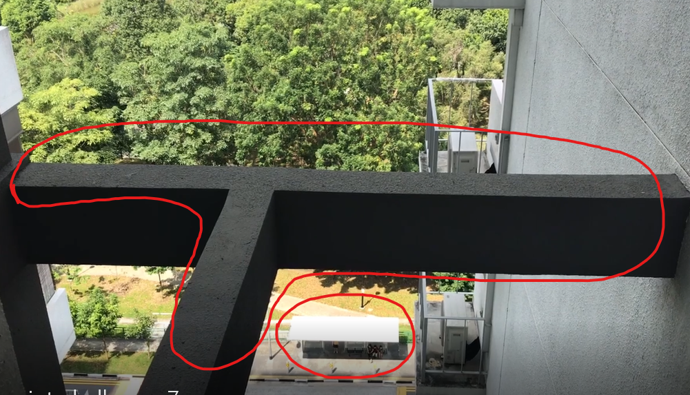

# Sounds of freedom!

> Points: 861 [1000]

## Description

> In a recent raid on a suspected COViD hideout, we found this video in a thumbdrive on-site. We are not sure what this video signifies but we suspect COViD's henchmen might be surveying a potential target site for a biological bomb. We believe that the attack may happen soon. We need your help to identify the water body in this video! This will be a starting point for us to do an area sweep of the vicinity!
>
> Please view this [Document](https://docs.google.com/document/d/1GrQ6znlN2Z0tu_uAPAs1qrn6by24I51mq8RIIHmFGDU/edit?usp=sharing) for download instructions.
>
> Flag Format: govtech-csg{postal_code}
>
> This challenge:
> - Unlocks other challenge(s)
> - Is eligible for Awesome Write-ups Award
> - Prerequisite for Mastery Award - Intelligence Officer
 
## Solution

Judging from the video, it sounded like there were fighter jets flying past and were quite near to wherever the video was taken at. Therefore, it must have been near to an air base. In the video, there was a park with a large water body in front of the building.

The water body that we first identified was "Punggol Park" and was located near "Paya Lebar Air Base". Zooming in to the residence near the park using [Google Maps](https://www.google.com/maps/@1.3757978,103.8996965,3a,75y,5.74h,116.04t/data=!3m6!1e1!3m4!1sNlxpllu6kKQrln3uk4urhQ!2e0!7i16384!8i8192), 

 

We can now confirm that the video was taken from a building in "Parkland Residences". Therefore, the postal code (provided by Google) is `538768`.

## Flag
`govtech-csg{538768}`