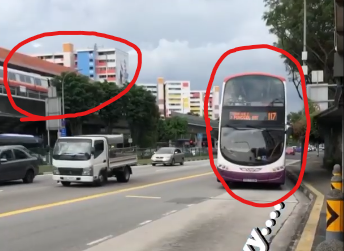
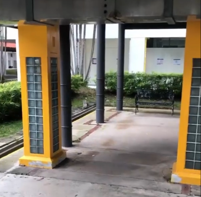
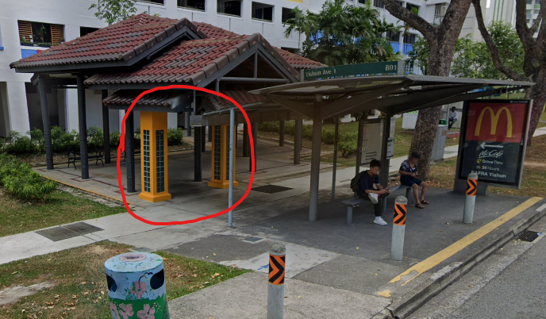
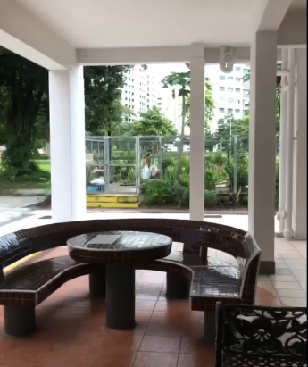
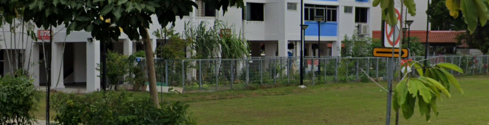
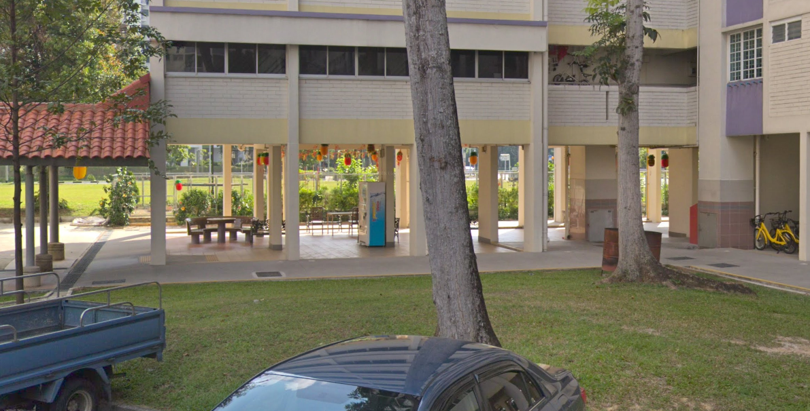

# Where was he kidnapped?

> Points: 865 [1000]

## Description

> The missing engineer stores his videos from his phone in his private cloud servers. We managed to get hold of these videos and we will need your help to trace back the route taken he took before going missing and identify where he was potentially kidnapped!
>
> You only have limited number of flag submissions!
>
> Please view this [Document](https://docs.google.com/document/d/1GrQ6znlN2Z0tu_uAPAs1qrn6by24I51mq8RIIHmFGDU/edit?usp=sharing) for download instructions.
>
> Flag Format: govtech-csg{postal_code}
>
> This challenge:
> - Is eligible for Awesome Write-ups Award

## Solution

In [`video-1.mp4`](video-1.mp4), we can see that the engineer was going to board the bus "117" and was at a bus stop opposite an MRT station. Fortunately, one of us happen to stay near here and was able to immediately identify that the video was taken at the bus stop opposite of "Khatib" MRT! Since the engineer was opposite the MRT station, he must be taking towards "Punggol Temporary Interchange".

Next, in [`video-2.mp4`](video-2.mp4), we can see the yellow pillars which are very eye-catching and had actually helped us to drill down on the stop he alighted from. Checking out each bus stop with [Google Maps](https://www.google.com/maps/@1.412745,103.8377924,3a,75y,25.71h,77.83t/data=!3m6!1e1!3m4!1swMQlBO6IxGYLnPuiC-W8uQ!2e0!7i16384!8i8192) that was listed by [TransitLink](https://www.transitlink.com.sg/eservice/eguide/service_route.php?service=117), we were able to identify that he alighted at Blk 871. 

Lastly, in [`video-3.mp4`](video-3.mp4),

We see that he was last seen at a block that had a table and what looks like a "cage". If we followed the road that the bus was on using [Google Maps](https://www.google.com/maps/@1.4130383,103.8386528,3a,22.5y,300.08h,89.14t/data=!3m6!1e1!3m4!1sgrB9cf9sPH4fmWu7q5Kwiw!2e0!7i16384!8i8192), we would be able to see the cage that was beside blk 870.

To further confirm our finding, we went to view the building from another [angle](https://www.google.com/maps/@1.4132608,103.8379393,3a,75y,60.09h,84.1t/data=!3m6!1e1!3m4!1seW8RJNGwX2BgTjUi3tyBng!2e0!7i16384!8i8192) and was able to locate see the table and a bit of the cage.

With Google's help, we were able to identify that the postal code of this building was `760870`.

## Flag
`govtech-csg{760870}`