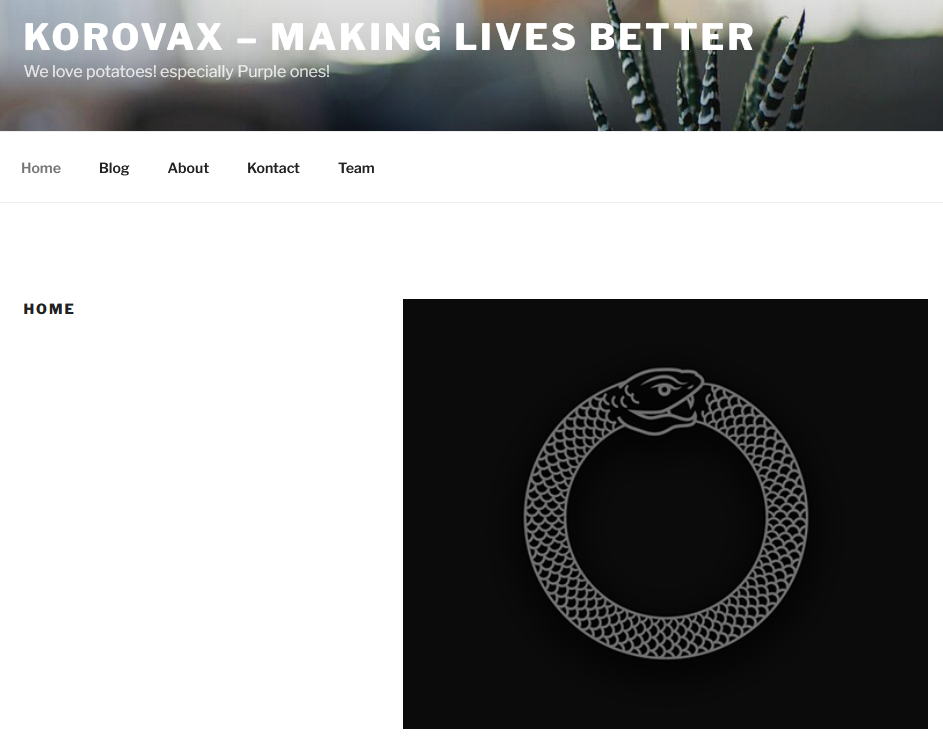
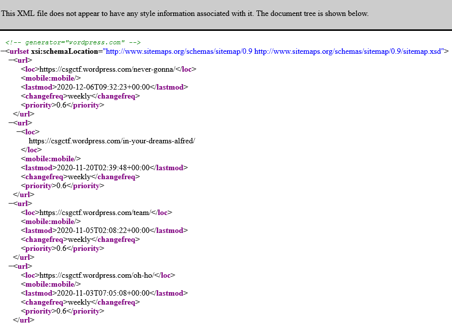
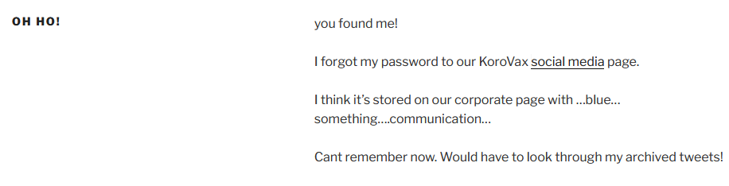
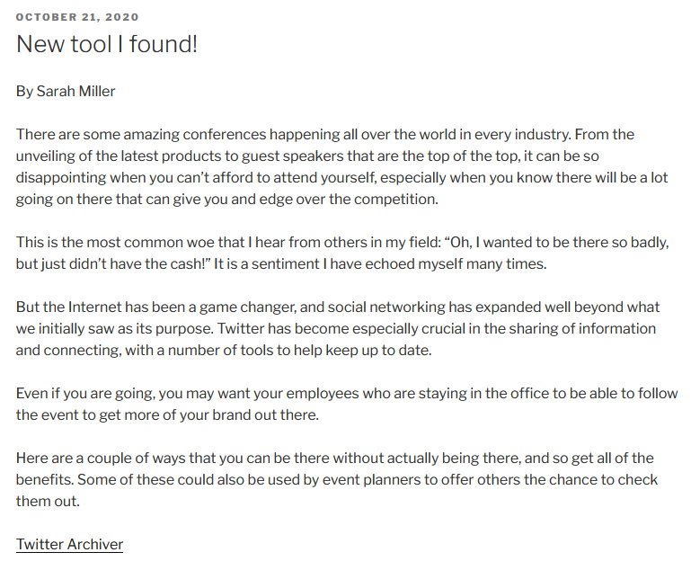
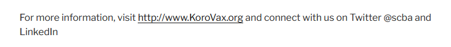
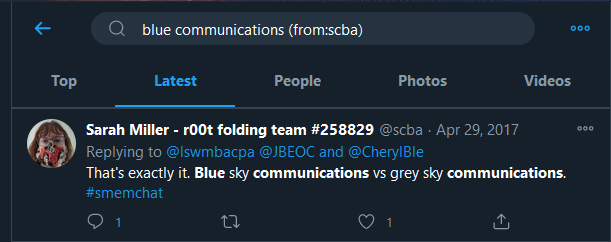

# Who are the possible kidnappers?

> Points: 1987 [2000]

## Description

>Perform OSINT to gather information on the organisation’s online presence. Start by identifying a related employee and obtain more information. Information are often posted online to build the organization's or the individual's online presence (i.e. blog post). Flag format is the name of the employee and the credentials, separated by an underscore. For example, the name is Tina Lee and the credentials is MyPassword is s3cure. The flag will be govtech-csg{TinaLee_MyPassword is s3cure}
>
> This challenge:
> - Unlocks other challenge(s)
> - Is eligible for Awesome Write-ups Award
>
> Addendum:
> - Look through the content! Have you looked through ALL the pages? If you believe that you have all the information required, take a step back and analyse what you have.
> - In Red Team operations, it is common for Red Team operators to target the human element of an organisation. Social medias such as "Twitter" often have information which Red Team operators can use to pivot into the organisation. Also, there might be hidden portal(s) that can be discovered through "sitemap(s)"?
>
> I guess if you can log in with the password, then you should look at the flag format again!
>
> Note: engaging/contacting Ms. Miller is not in scope for this ctf.

## Solution

The orgnisation we are suppose to hunt for is "KoroVax". With a bit of Google Hacking, I was able to find their website: `korovax.org`.

The addenum mentioned about a sitemap, which led to us trying [`/sitemap.xml`](http://korovax.org/sitemap.xml), which presented us all the pages that this website has. It seems that this website can also be visited using `https://csgctf.wordpress.com/`.

Out of all the pages, there was one page at [`/oh-ho/`](https://korovax.org/oh-ho/) that led to our next clue: 

The underlined "social media" was linked to what seems to be [Facebook replica](http://fb.korovax.org)?

Going back to the [`/oh-ho/`](https://korovax.org/oh-ho/) page, we need to first figure out who might have written this page and search their Twitter for their password.

There was another page at [`/2020/10/21/new-tool-i-found/`](http://korovax.org/2020/10/21/new-tool-i-found/)

Sarah Miller was writing about a new tool she discovered called [`Twitter Archiver`](https://workspace.google.com/marketplace/app/tweet_archiver/976886281542). The [`/oh-ho/`](http://korovax.org/oh-ho/) page did talk about archived tweets, hence the person we need to search up is probably Sarah Miller.

There were many Sarah Millers on Twitter, making it very difficult to drill down into the correct account. Fortunately, one of our team members found her Twitter handle [`@scba`](https://twitter.com/scba) by chance when reviewing the other pages on the [website](https://korovax.org/2020/10/01/example-post-3/). 

The [`/oh-ho/`](https://korovax.org/oh-ho/) page did mention about `blue..something...communication`, so lets use the words `blue` and `communications` and do a search on [Twitter](https://twitter.com/search?q=blue%20communications%20(from%3Ascba)&src=typed_query&f=live).

Maybe the password is `Blue sky communications`? According to the the [organisation website](http://korovax.org/team/), her email was `sarahmiller@korovax.org`. With her email and password, we were able to login to her account on the [Facebook replica](http://fb.korovax.org)!

## Flag
`govtech-csg{SarahMiller_Blue sky communications}`