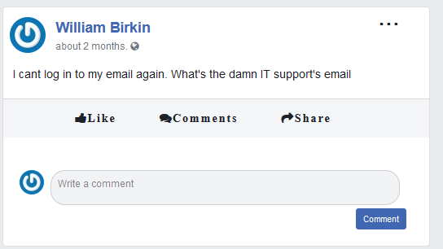
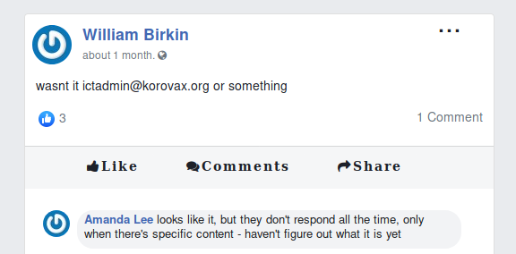
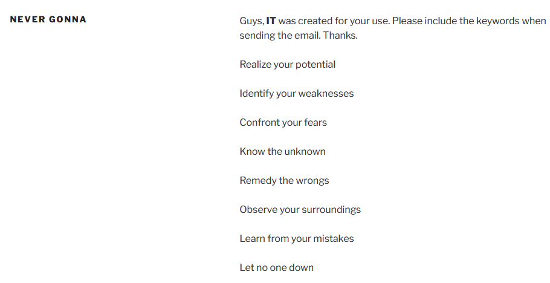
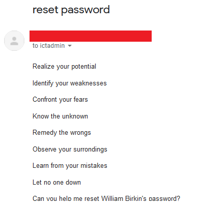
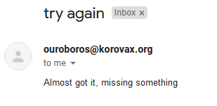
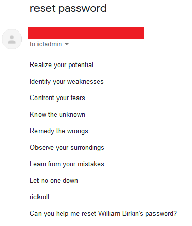
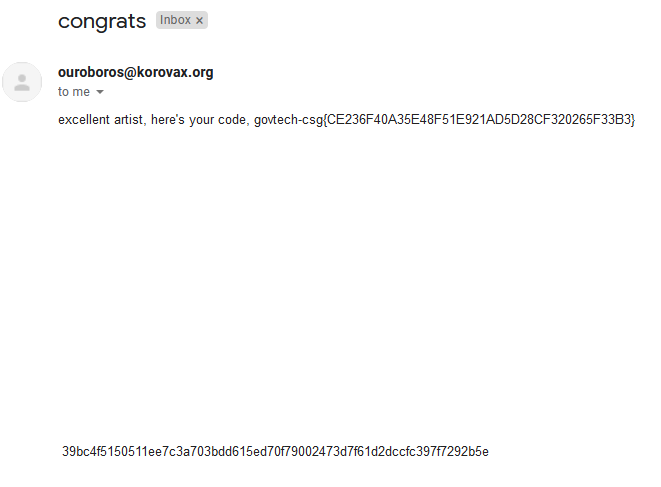

# Can you trick OrgX into giving away their credentials?

> Points: 1988 [2000]

## Description

> With the information gathered, figure out who has access to the key and contact the person.
> 
> This challenge:
> - Unlocks other challenge(s)
> - Is eligible for Awesome Write-ups Award
>- Prerequisite for Mastery Award - Chief Human Hacker

## Solution

On KoroVax's [Facebook replica](http://fb.korovax.org), we found a user called "William Birkin" who was writing about resetting his password (We can't remember and we didn't save a screenshot for this). 

He was also confirming the email of what seems to be the IT Support of the organisation, which is `ictadmin@korovax.org`. There was a comment by his colleague Amanda Lee, who said that they will only respond "when there's specific content".

There was a page at [`/never-gonna/`](http://korovax.org/never-gonna/) on KoroVax's website stating on how to communicate with "IT".

Thinking that the "specific content" is referring to the list from "Realise your potential" to "Let no one down", we crafted an email to `ictadmin@korovax.org` with these lines, asking to reset William Birkin's password.

Unfortunately, we were close but still not there yet.

We noticed that the first letter of each line spelled out "RICKROLL", so we decided to add it to our message.

After a while, we got our flag!

## Flag
`govtech-csg{CE236F40A35E48F51E921AD5D28CF320265F33B3}`