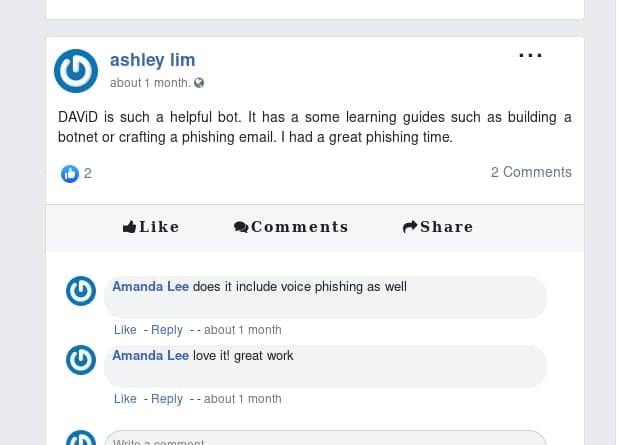
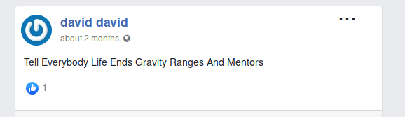
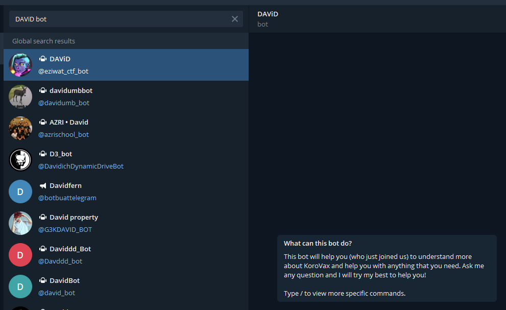
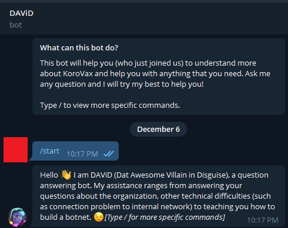
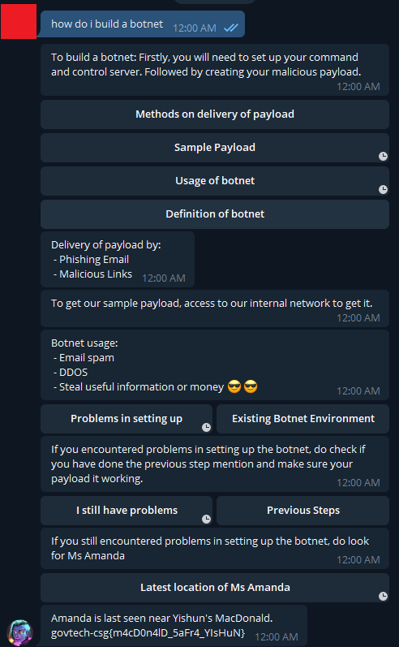

# Find the last seen location of where one of the Korovax's staff is at.

> Points: 1990 [2000]

## Description

> The evil organisation ‘KoroVax’ has a self help chatbot for new joiners or normal employees to know more about their own organisation. Use this chatbot to ask question and find out more about information about the organisation. Try to get information out of the chatbot!
>
> This challenge:
> - Unlocks other challenge(s)
> - Is eligible for Awesome Write-ups Award
> - Prerequisite for Mastery Award - Chief Human Hacker

## Solution

In KoroVax's [Facebook replica](http://fb.korovax.org), on Ashley's profile, there was a mention of a bot called "DAViD".

There was also a "david david" account on the Facebook replica which had a post hinting that the bot might be running on Telegram. (If you look at the first letter of each word, it will spell "TELEGRAM")

Within Telegram, I simply searched for `DAViD bot` and found the bot!

There were a whole list of commands, but neither of them really fit my needs. I started asking "where is ____", using different names of the employeees found from the Facebook replica but it mostly responded "Sorry, we do not have his/her location". 

Referring back to the bot's first message, it was oddly specific about teaching how to build a botnet so I went to ask about it.

Got the flag!

## Flag
`govtech-csg{m4cD0n4lD_5aFr4_YIsHuN}`